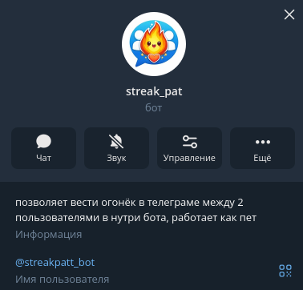
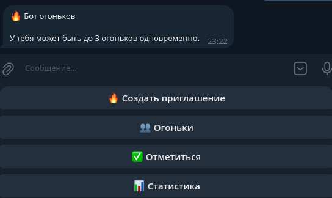

<p align="center">
  
</p>

---

<h2> A bot for keeping streaks in Telegram. Just like on TikTok, it tracks user activity and marks them every day:</h2>
<p align="center">
  
</p>

The bot is written in Python, which allows you to easily modify its code depending on your needs. The bot has a connected self-generating database that keeps track of all your series. The bot also sends notifications as reminders about your lights. All you need is to have a friend and Telegram, and that's it. And your little spark can already be ready with the help of this bot.

---

<h1>here is a brief instruction on how to run the bot manually on your own </h1>
1. Create a bot folder

For example:
```yaml
C:\streak-pet-bot
```
we throw the bot file there

2. we open the bot file and find the line:
```yaml
TOKEN = "your_Тtoken_bot"
```
3. In Telegram, go to BotFather and paste the token that it will give here:
```yaml
TOKEN = "123454156hgfjhbfjhb"
```
4. Next open the terminal in the folder

5. Iinstalling the libraries that the bot asks for
```yaml
pip install ......
```
6.started bot
```yaml
python bot.py
```
or
```yaml 
py bot.py

```
---

<h3>I would like to ask you to help the bot's author and write what you would like to see in this bot, what to add or what to fix. Thank you in advance.</h3>
